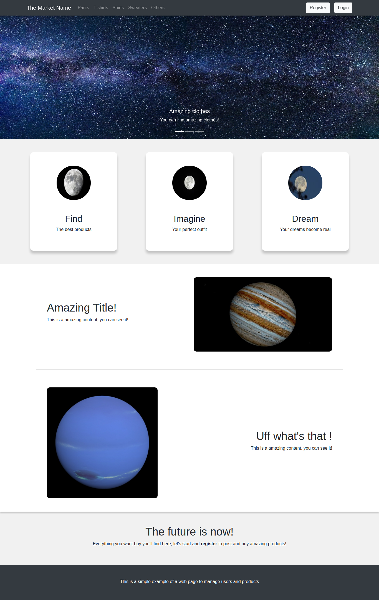
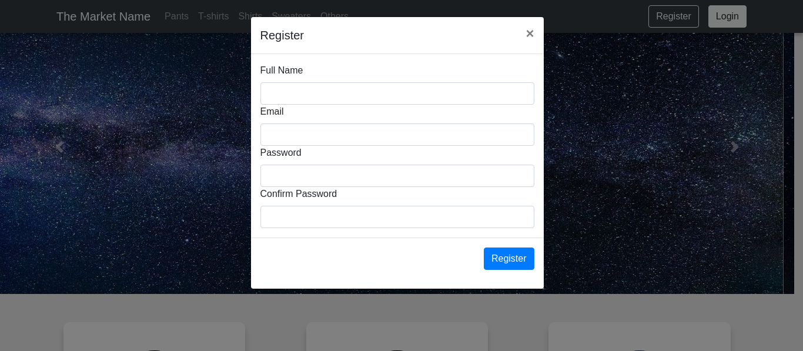
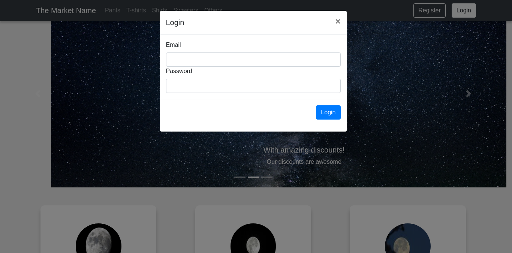
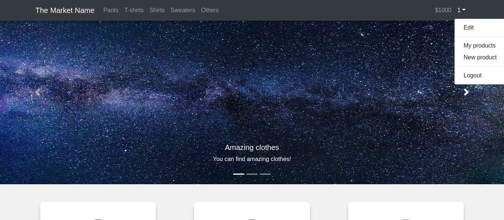
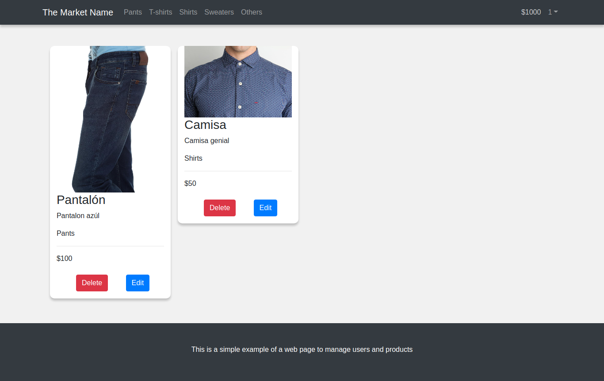
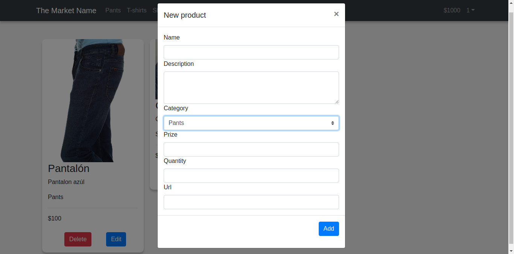
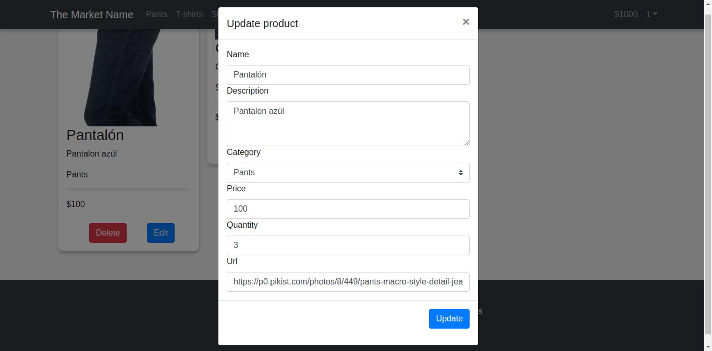
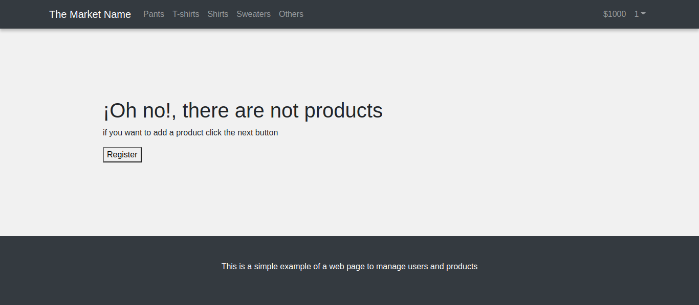
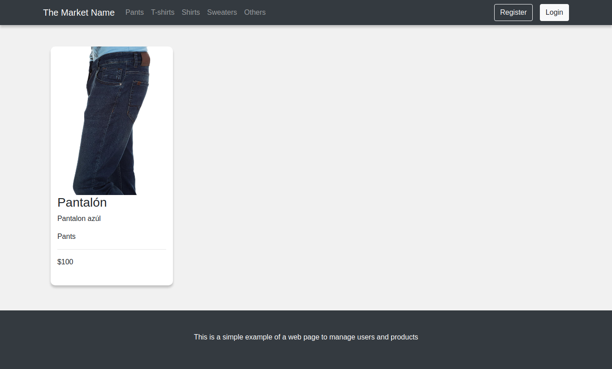
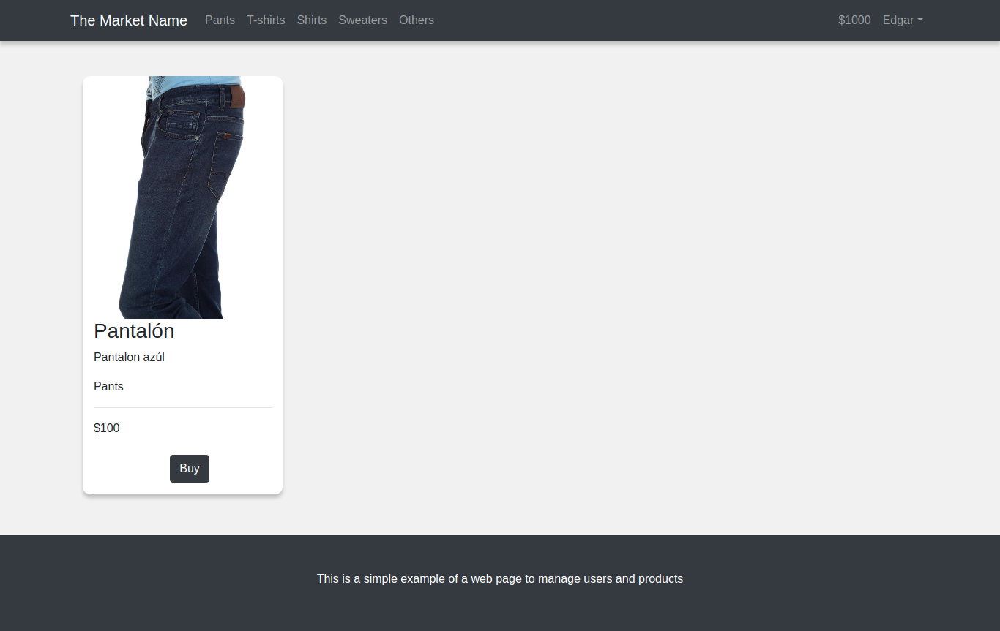

# InventaryNodeJS

This project is about an inventary like online store, which the users registered can simulate buys and manage the CRUD of themself and their products.  

## Requirements
You need the following programs:
* NodeJS (>=15)
* Npm (>=7)
* MongoDB

## Packages Backend
* Express JS (>=4)
* Pug JS (>=3)
* Mongoose (>=5)
* Body-Parser (>=1.19)
* Express-Session (>=1.17)

## Packages Frontend
* Bootstrap (4.5.3)
* Vue JS (2.4.16)
* jQuery (3.5.1)


## Installation

First download the project or clone the repository. Inside the main folder don't forget run the next command to  install the dependencies.

```bash
npm install
```

## Run
In order to start the project you have to locate in the main folder, open a terminal an run the next command

```bash
npm start
```
## Views
Principal page


Register modal


Login modal


Menu logged


My products


New product


Update product


No products


Filter by


Buying

